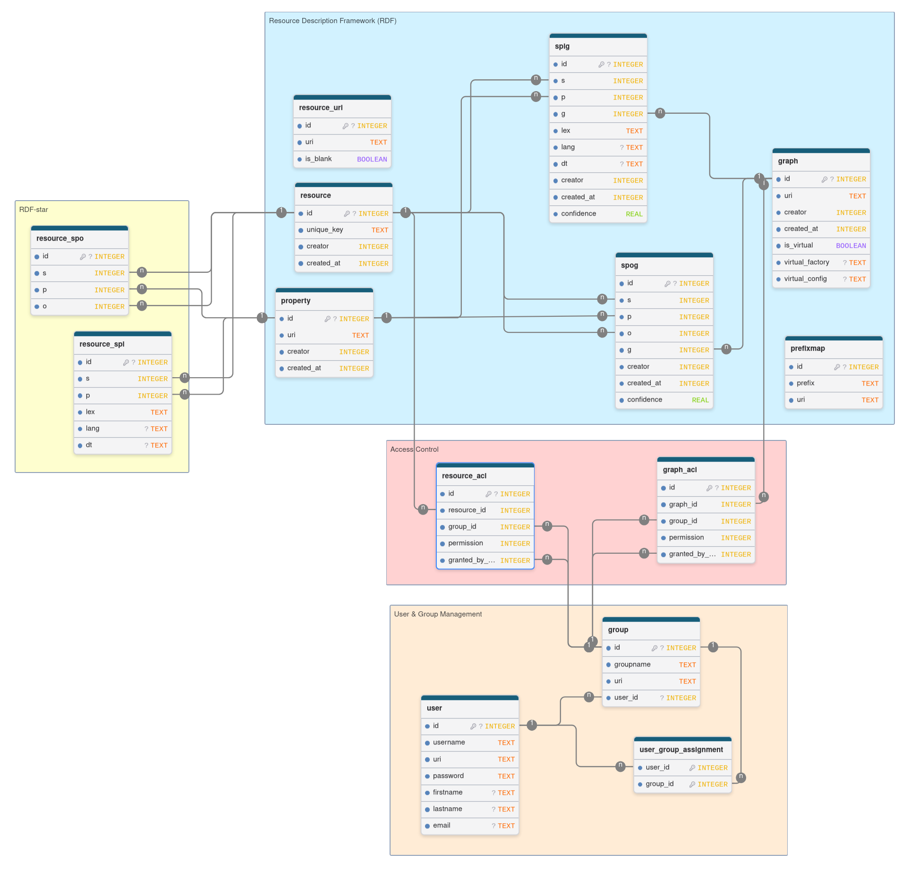
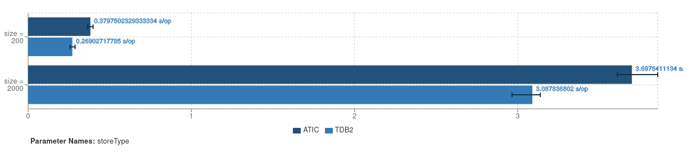
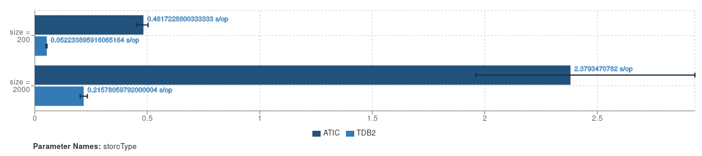

# Towards ATIC: A Specialized Quadstore Tailored for Corporate Memories

<div align="center" style="font-size: 20px">

 🚀 [Overview](#overview) • 📦 [Installation](#installation) • ⚙️ [Usage](#usage) • 🛠️ [Developer Guide](#developer-guide) • 📊 [Evaluation](#evaluation)

</div>

**Table of Contents**

<!-- TOC depthFrom:2 depthTo:5 withLinks:1 updateOnSave:1 orderedList:0 -->

- [Overview](#overview)
- [Installation](#installation)
- [Usage](#usage)
	- [Developer API (Java / SDK)](#developer-api-java-sdk)
		- [Factory](#factory)
		- [Using the Dataset](#using-the-dataset)
		- [ATIC-Specific Methods](#atic-specific-methods)
			- [Invocation Context](#invocation-context)
			- [User \& Group Management](#user-group-management)
			- [Discretionary Access Control (Sharing)](#discretionary-access-control-sharing)
			- [Virtual Graph](#virtual-graph)
			- [RDF Patch Apply and Listener](#rdf-patch-apply-and-listener)
			- [Data Generation](#data-generation)
			- [Query Logger](#query-logger)
	- [REST / Server Usage](#rest-server-usage)
		- [Configuration](#configuration)
		- [Authorization](#authorization)
		- [POST `/auth/register`](#post-authregister)
		- [POST `/auth/token`](#post-authtoken)
		- [GET `/auth/me`](#get-authme)
		- [POST `/auth/logout`](#post-authlogout)
		- [GET `/config`](#get-config)
		- [GET `/config/{name}`](#get-configname)
		- [GET `/sparql`](#get-sparql)
		- [POST `/sparql`](#post-sparql)
		- [POST `/update`](#post-update)
		- [GET `/graph`](#get-graph)
		- [POST `/graph`](#post-graph)
		- [DELETE `/graph/{uri}`](#delete-graphuri)
		- [POST `/graph/share`](#post-graphshare)
		- [DELETE `/graph/share`](#delete-graphshare)
		- [GET `/graph/access`](#get-graphaccess)
		- [POST `/resource/share`](#post-resourceshare)
		- [DELETE `/resource/share`](#delete-resourceshare)
		- [GET `/resource/access`](#get-resourceaccess)
		- [POST `/upload`](#post-upload)
		- [GET `/principal`](#get-principal)
- [Developer Guide](#developer-guide)
	- [atic-api](#atic-api)
		- [jenatic](#jenatic)
		- [ac](#ac)
		- [api](#api)
		- [conf](#conf)
	- [atic-sqlite](#atic-sqlite)
		- [SQL Database Schema](#sql-database-schema)
			- [Resource Description Framework (RDF)](#resource-description-framework-rdf)
			- [User & Group Management](#user-group-management)
			- [Access Control](#access-control)
			- [RDF-star](#rdf-star)
		- [Java Classes](#java-classes)
	- [atic-server](#atic-server)
		- [Java Classes](#java-classes)
- [Evaluation](#evaluation)
	- [Correctness](#correctness)
	- [Performance](#performance)
		- [AticTdbComparisonBsbmLoading](#atictdbcomparisonbsbmloading)
		- [AticTdbComparisonBsbmQueryMix](#atictdbcomparisonbsbmquerymix)

<!-- /TOC -->

## Overview

Corporate Memories are computer systems in organizations that continuously collect, update and structure knowledge for various tasks.
The Resource Description Framework (RDF) is commonly used to represent such knowledge, which is stored in quadstores as subject–predicate–object–graph quadruples.
Since typical RDF stores lack crucial features for enterprise scenarios, we propose an initial version of a tailored quadstore as part of a larger system called ATIC.
Our implementation in this demo paper comprises RDF management with an SQLite backend, Discretionary Access Control on graphs and resources, confidence-attributed triples, change tracking with RDF patches and a virtual graph for accessing a file hosting service via RDF.
This is accompanied with a server component providing endpoints and corresponding frontends.
Results of a preliminary evaluation verify the correct operation of our prototype and indicate moderate performance.

Our [demo page](https://www.dfki.uni-kl.de/~mschroeder/demo/atic/) contains a link to a deployed instance for testing and also presents a video showing the main aspects in action.

## Installation

To build and install all projects, run:
```
mvn install
```

If you would like to skip the JUnit test cases, run:
```
mvn install -DskipTests
```

If you would like to get the executable `atic.jar` which contains the server component, run:
```
mvn install -DskipTests -Pdeploy -pl atic-server -am
```
You will find the file under `atic-server/target/atic.jar`.


## Usage

### Developer API (Java / SDK)

Include this project in your pom.xml as a dependency:
```xml
<dependency>
    <groupId>de.dfki.sds</groupId>
    <artifactId>atic-sqlite</artifactId>
    <version>1.0.0</version>
</dependency>
```

#### Factory

Use its factory, to create an instance (similar to TDB2):
```java
Dataset dataset = AticFactory.connectDataset("path/to/folder");
```

For testing purposes, you can create a `DatasetGraph` backed by a temporary storage location.
```java
DatasetGraph datasetGraph = AticFactory.createTxn();
```

Use this for accessing the `DatasetGraph` as `admin` user.
```java
DatasetGraph datasetGraph = AticFactory.createTxnAdminDataset();
```

#### Using the Dataset

Use it as a [Jena Dataset](https://jena.apache.org/documentation/javadoc/arq/org.apache.jena.arq/org/apache/jena/query/Dataset.html).

To switch the user who invokes the calls:

```java
User user = server.getDatasetGraph().calculateRead(() -> {
    return server.getDatasetGraph().getUser(username, InvocationContext.EMPTY);
});
InvocationContext ictx = new InvocationContext.Builder().fromUser(user).build();
ictx.transferContext(dataset.getContext());
```

#### ATIC-Specific Methods

Cast to our specific implementation to access the methods.

```java
DatasetGraph datasetGraph;
SqliteAticDatasetGraph aticDatasetGraph = (SqliteAticDatasetGraph) datasetGraph;
```

##### Invocation Context

Each method is extended with an `InvocationContext` which mainly states what user is requesting the operation.
You can build an `InvocationContext` from a `User` in the following way:
```java
User user = server.getDatasetGraph().calculateRead(() -> {
    return server.getDatasetGraph().getUser(username, InvocationContext.EMPTY);
});
InvocationContext ictx = new InvocationContext.Builder().fromUser(user).build();
```

Users with different permissions may receive different results for the same operations and arguments.
```java
InvocationContext user1ctx;
InvocationContext user2ctx;

datasetGraph.find(Node.ANY, Node.ANY, Node.ANY, Node.ANY, user1ctx);
datasetGraph.find(Node.ANY, Node.ANY, Node.ANY, Node.ANY, user2ctx);
```

To pass no `InvocationContext` use `InvocationContext.EMPTY` constant.  

##### User \& Group Management

* `String addUser(String firstname, String lastname, String email, String username, InvocationContext ctx)`
* `void addGroup(String groupname, InvocationContext ctx)`
* `User getUser(String username, InvocationContext ctx)`
* `User getUser(int userId, InvocationContext ctx)`
* `Group getGroup(String groupname, InvocationContext ctx)`
* `void assignUserToGroup(String username, String groupname, InvocationContext ctx)`
* `void unassignUserFromGroup(String username, String groupname, InvocationContext ctx)`
* `List<User> searchUsers(String query, InvocationContext ctx)`
* `List<Group> searchGroups(String query, InvocationContext ctx)`
* `List<Principal> searchPrincipals(String query, InvocationContext ctx)`

##### Discretionary Access Control (Sharing)

* `void shareGraphs(Set<String> graphUris, Set<String> groupUris, Permission permission, InvocationContext ctx)`
* `void unshareGraphs(Set<String> graphUris, Set<String> groupUris, InvocationContext ctx)`
* `void shareResources(Set<String> resourceUris, Set<String> groupUris, Permission permission, InvocationContext ctx)`
* `void unshareResources(Set<String> resourceUris, Set<String> groupUris, InvocationContext ctx)`
* `Map<String, Permission> listResourcePermissions(Set<String> resourceUris, InvocationContext ctx)`
* `Map<String, Permission> listGraphPermissions(Set<String> graphUris, InvocationContext ctx)`
* `Map<String, List<PrincipalPermission>> listPrincipalPermissions( Set<String> uris, boolean forGraphs, InvocationContext ctx)`

##### Virtual Graph

* `void addVirtualGraph(Node graphName, String factoryMethodPath, JSONObject config, InvocationContext ctx)`

##### RDF Patch Apply and Listener

* `void apply(RDFPatch rdfPatch, InvocationContext ctx)`
* `void addListener(RDFPatchListener listener)`
* `void removeListener(RDFPatchListener listener)`

##### Data Generation

* `void generateLUBMftGraph(Node graphName, int univNum, int startIndex, int seed, boolean names, boolean docs, int bufferSize, int batchSize, InvocationContext ctx)`

##### Query Logger

* `void enableQueryLogger(String dbFilePath)`
* `void disableQueryLogger()`

### REST / Server Usage

Use the `atic.jar` built by the `atic-server` project (see [Installation](#installation)).

```bash
export JWT_SECRET="my-secret"
java -jar atic.jar
```

By default, the server runs at `http://127.0.0.1:6583`.

#### Configuration

Use `--help` for possible CLI arguments.

```
java -jar atic.jar --help
```

You can also specify the options in a `atic.toml` file located in the working directory.

It is also possible to specify the options as environment variables.
In this case, an option, for example, `instance.name` has to be defined as `ATIC_INSTANCE_NAME`.

#### Authorization

All endpoints except `/auth/register` and `/auth/token` require a bearer token:

```bash
-H "Authorization: Bearer <TOKEN>"
```

#### POST `/auth/register`

Creates a new user account.

```bash
curl -X POST http://127.0.0.1:6583/auth/register \
  -d "firstname=John" \
  -d "lastname=Doe" \
  -d "email=john@example.org" \
  -d "username=jdoe"
```

A generated password is returned.
Passwords are stored for lookup in a `passwords.json.generated` file.

#### POST `/auth/token`

Authenticates a user and returns a JWT access token.

```bash
curl -X POST http://127.0.0.1:6583/auth/token \
  -d "username=jdoe" \
  -d "password=secret"
```

On success, the server returns a JSON response containing the access token (and a corresponding cookie):

```json
{
  "access_token": "<TOKEN>",
  "successful": true,
  "redirect": "/"
}
```

#### GET `/auth/me`

Returns information about the currently authenticated user.

```bash
curl \
  -H "Authorization: Bearer <TOKEN>" \
  http://127.0.0.1:6583/auth/me
```


#### POST `/auth/logout`

Logs out the current user.

```bash
curl -X POST \
  -H "Authorization: Bearer <TOKEN>" \
  http://127.0.0.1:6583/auth/logout
```


#### GET `/config`

Returns all visible configuration entries.

```bash
curl \
  -H "Authorization: Bearer <TOKEN>" \
  http://127.0.0.1:6583/config
```


#### GET `/config/{name}`

Returns a single configuration value.

```bash
curl \
  -H "Authorization: Bearer <TOKEN>" \
  http://127.0.0.1:6583/config/port
```


#### GET `/sparql`

Executes a SPARQL query.

```bash
curl --get \
  -H "Authorization: Bearer <TOKEN>" \
  http://127.0.0.1:6583/sparql \
  --data-urlencode "query=SELECT * WHERE { ?s ?p ?o } LIMIT 10"
```


#### POST `/sparql`

Executes a SPARQL query.

```bash
curl -X POST \
  -H "Authorization: Bearer <TOKEN>" \
  http://127.0.0.1:6583/sparql \
  --data 'SELECT * WHERE { ?s ?p ?o } LIMIT 10'
```


#### POST `/update`

Executes a SPARQL Update request.

```bash
curl -X POST \
  -H "Authorization: Bearer <TOKEN>" \
  http://127.0.0.1:6583/update \
  --data 'INSERT DATA { GRAPH <https://example.org/g> { <a> <b> <c> } }'
```


#### GET `/graph`

Returns graphs accessible to the current user.

```bash
curl \
  -H "Authorization: Bearer <TOKEN>" \
  "http://127.0.0.1:6583/graph"
```

```bash
curl \
  -H "Authorization: Bearer <TOKEN>" \
  "http://127.0.0.1:6583/graph?triples"
```

```bash
curl \
  -H "Authorization: Bearer <TOKEN>" \
  "http://127.0.0.1:6583/graph?permissions"
```


#### POST `/graph`

Creates a graph.

```bash
curl -X POST \
  -H "Authorization: Bearer <TOKEN>" \
  http://127.0.0.1:6583/graph
```

```bash
curl -X POST \
  -H "Authorization: Bearer <TOKEN>" \
  -H "Content-Type: application/json" \
  http://127.0.0.1:6583/graph \
  -d '{"graph":"https://example.org/graph/my-graph"}'
```


#### DELETE `/graph/{uri}`

Deletes a graph.

```bash
curl -X DELETE \
  -H "Authorization: Bearer <TOKEN>" \
  "http://127.0.0.1:6583/graph/https%3A%2F%2Fexample.org%2Fgraph%2Fmy-graph"
```


#### POST `/graph/share`

Shares graphs with groups.

```bash
curl -X POST \
  -H "Authorization: Bearer <TOKEN>" \
  -H "Content-Type: application/json" \
  http://127.0.0.1:6583/graph/share \
  -d '{
    "graphs": ["https://example.org/graph/a"],
    "groups": ["https://example.org/group/admins"],
    "permission": "READ"
  }'
```


#### DELETE `/graph/share`

Removes a previously granted permission from groups.

```bash
curl -X DELETE \
  -H "Authorization: Bearer <TOKEN>" \
  -H "Content-Type: application/json" \
  http://127.0.0.1:6583/graph/share \
  -d '{
    "graphs": ["https://example.org/graph/a"],
    "groups": ["https://example.org/group/admins"],
    "permission": "READ"
  }'
```


#### GET `/graph/access`

Returns the permissions assigned to one or more graphs.

The endpoint accepts one or more graph URIs via the `uri` query parameter.

```bash
curl --get \
  -H "Authorization: Bearer <TOKEN>" \
  http://127.0.0.1:6583/graph/access \
  --data-urlencode "uri=https://example.org/graph/a"
```

Response:

```json
{
  "https://example.org/graph/a": [
    {
      "principalName": "Administrators",
      "principalUri": "https://example.org/group/admins",
      "principalShareUri": "https://example.org/share/admins",
      "permission": "ADMIN",
      "type": "group"
    },
    {
      "principalName": "John Doe",
      "principalUri": "https://example.org/user/jdoe",
      "principalShareUri": "https://example.org/share/jdoe",
      "permission": "READ",
      "type": "user"
    }
  ]
}
```

#### POST `/resource/share`

Shares resources with groups.

```bash
curl -X POST \
  -H "Authorization: Bearer <TOKEN>" \
  -H "Content-Type: application/json" \
  http://127.0.0.1:6583/resource/share \
  -d '{
    "resources": ["https://example.org/resource/a"],
    "groups": ["https://example.org/group/admins"],
    "permission": "READ"
  }'
```

#### DELETE `/resource/share`

Removes a previously granted permission from groups.

```bash
curl -X DELETE \
  -H "Authorization: Bearer <TOKEN>" \
  -H "Content-Type: application/json" \
  http://127.0.0.1:6583/resource/share \
  -d '{
    "resources": ["https://example.org/resource/a"],
    "groups": ["https://example.org/group/admins"],
    "permission": "READ"
  }'
```


#### GET `/resource/access`

Returns the permissions assigned to one or more resources.

The endpoint accepts one or more resource URIs via the `uri` query parameter.

```bash
curl --get \
  -H "Authorization: Bearer <TOKEN>" \
  http://127.0.0.1:6583/resource/access \
  --data-urlencode "uri=https://example.org/resource/a"
```

Response:

```json
{
  "https://example.org/resource/a": [
    {
      "principalName": "Researchers",
      "principalUri": "https://example.org/group/researchers",
      "principalShareUri": "https://example.org/share/researchers",
      "permission": "READ",
      "type": "group"
    },
    {
      "principalName": "John Doe",
      "principalUri": "https://example.org/user/jdoe",
      "principalShareUri": "https://example.org/share/jdoe",
      "permission": "EDIT",
      "type": "user"
    }
  ]
}
```


#### POST `/upload`

Uploads RDF data or files.

Optionally, the imported data can be assigned to a graph and permissions can be granted to groups for resources contained in the imported dataset.


```bash
curl -X POST \
  -H "Authorization: Bearer <TOKEN>" \
  -F "file=@data.ttl" \
  http://127.0.0.1:6583/upload
```


Upload into a specific graph:

```bash
curl -X POST \
  -H "Authorization: Bearer <TOKEN>" \
  -F "file=@data.ttl" \
  -F "graph=https://example.org/graph/my-graph" \
  http://127.0.0.1:6583/upload
```

Upload data and grant read access to a group for imported resources:

```bash
curl -X POST \
  -H "Authorization: Bearer <TOKEN>" \
  -F "file=@data.ttl" \
  -F "group=https://example.org/group/researchers" \
  -F "permission=READ" \
  http://127.0.0.1:6583/upload
```

Upload data with custom import settings:

```bash
curl -X POST \
  -H "Authorization: Bearer <TOKEN>" \
  -F "file=@data.ttl" \
  -F "buffer-size=1000" \
  -F "batch-size=1000" \
  http://127.0.0.1:6583/upload
```


#### GET `/principal`

Searches principals (users and groups) matching the provided search query.

```bash
curl --get \
  -H "Authorization: Bearer <TOKEN>" \
  http://127.0.0.1:6583/principal \
  --data-urlencode "query=admin"
```

The response contains a list of matching principals:

```json
{
  "principals": [
    {
      "uri": "https://example.org/group/admins",
      "name": "Administrators"
    }
  ]
}
```

## Developer Guide

The following projects exist:
* atic-api - contains interfaces and data classes
* atic-sqlite - quadstore implementation for SQLite
* atic-server - server component and frontends

Additonal projects for [evaluation](#evaluation):
* atic-sqlite-tdb2tests - JUnit test cases from TDB2
* atic-sqlite-jmh - uses Java Microbenchmark Harness (JMH) for benchmarking

### atic-api

The API project is separated into six packages: `jenatic`, `ac` (Access Control), `api`, `conf`, `helper`,  and `vocab`.

#### jenatic

*jenatic* is a blend word between Jena and ATIC to emphasise that Jena interfaces are extended for our prototype.

[InvocationContext](atic-api/src/main/java/de/dfki/sds/atic/jenatic/InvocationContext.java) is a class to express the invocation of Jena methods from a certain context.
It is mainly used to state which user invokes the method by providing `userId`, `primaryGroupId` and `groupIds`.

[AticDatasetGraph](atic-api/src/main/java/de/dfki/sds/atic/jenatic/AticDatasetGraph.java) extends Jena's [DatasetGraph](https://jena.apache.org/documentation/javadoc/arq/org.apache.jena.arq/org/apache/jena/sparql/core/DatasetGraph.html) class by adding for certain methods context-awareness in form of an additional `InvocationContext` method parameter.
In case a legacy Jena method is called, `InvocationContext.EMPTY` is passed.
Analogously, [AticGraph](atic-api/src/main/java/de/dfki/sds/atic/jenatic/AticGraph.java) extends Jena's [Graph](https://jena.apache.org/documentation/javadoc/jena/org.apache.jena.core/org/apache/jena/graph/Graph.html) interface.

To pass more information in a triple, [AticTriple](atic-api/src/main/java/de/dfki/sds/atic/jenatic/AticTriple.java) extends Jena's [Triple](https://jena.apache.org/documentation/javadoc/jena/org.apache.jena.core/org/apache/jena/graph/Triple.html) class.
Currently, an additional `confidence` value can be stored.

For virtual graphs, a separate [AticVirtualGraph](atic-api/src/main/java/de/dfki/sds/atic/jenatic/AticVirtualGraph.java) exists which extends the `AticGraph` with an additonal method:
Since virtual graphs are allowed to response to REST requests, a `handleRequest` method can be implemented.
The method returns [AticVirtualGraphResponse](atic-api/src/main/java/de/dfki/sds/atic/jenatic/AticVirtualGraphResponse.java).

#### ac

The [UserGroupManagement](atic-api/src/main/java/de/dfki/sds/atic/ac/UserGroupManagement.java) interface defines methods for adding or removing users and groups as well as user group assignments.
The [SharingManagement](atic-api/src/main/java/de/dfki/sds/atic/ac/SharingManagement.java) interface defines methods for giving permissions to graphs and resources to principals.
A [Principal](atic-api/src/main/java/de/dfki/sds/atic/ac/Principal.java) (like [User](atic-api/src/main/java/de/dfki/sds/atic/ac/User.java) or [Group](atic-api/src/main/java/de/dfki/sds/atic/ac/Group.java)) can receive a permission from the [Permission](atic-api/src/main/java/de/dfki/sds/atic/ac/Permission.java) enum.
If a permission is denied a [PermissionDeniedException](atic-api/src/main/java/de/dfki/sds/atic/ac/PermissionDeniedException.java) is thrown.

#### api

The general api package contains data classes for two aspects:
associating numeric id values with textual URI values ([IdAndUri](atic-api/src/main/java/de/dfki/sds/atic/api/IdAndUri.java)) and mapping between objects and URIs used in virtual graphs ([UriMapper](atic-api/src/main/java/de/dfki/sds/atic/api/UriMapper.java)).

#### conf

The package is used for configuration management.

[Config](atic-api/src/main/java/de/dfki/sds/atic/conf/Config.java) is a field annotation used in [ConfigLoader](atic-api/src/main/java/de/dfki/sds/atic/conf/ConfigLoader.java).
The loader class is able to read configurations passed with `Config` annotations from TOML file, CLI arguments or environment variables.

### atic-sqlite

This project contains the Quadstore implementation.

#### SQL Database Schema



SQL files defining the database schema are located [here](atic-sqlite/src/main/resources/de/dfki/sds/aticsqlite/sql).

The schema is separated in four areas: Resource Description Framework (RDF), User & Group Management, Access Control and RDF-star.

##### Resource Description Framework (RDF)

Quadruples with literal objects are stored in `splg` table, while quadruples with resource objects are stored in `spog` table. Both store provenance information for `creator` (`user`) and `created_at` time as well as a `confidence` value.

A separate `graph` table manages graphs (fourth component of quadruple).
Aagin, provenance information for `creator` (`user`) and `created_at` time is saved.
Additionally, for virtual graphs corresponding meta-data is recorded.

Resources are stored in `resource` table and properties are stored in `property` table.
Aagin, provenance information for `creator` (`user`) and `created_at` time is saved.

Since a resource can be either a URI (including blank node) or triple term (RDF-star), there are additional tables `resource_uri` as well as `resource_spo` and `resource_spl` (see RDF-star).

For blank nodes, `is_blank` is set to 1 and `uri` is used for a skolemized blank node label.

Prefix mapping is recorded in `prefixmap` table.

##### User & Group Management

Users are stored in a `user` table with `username`, `firstname`, `lastname`, `email` and hashed `password` metadata as well as uniquely generated `uri`.

Groups are stored in `group` table with `groupname` and uniquely generated `uri`.
Since each user has a primary group (same `groupname` as `username`), a primary group refers to its user with `user_id`.

Assignments of users to groups is recorded in `user_group_assignment`.  


##### Access Control

Access control is enforced on resources (`resource_acl`) and graphs (`graph_acl`).
In both cases, the `group_id` that receives the `permission` which was granted by a group (`granted_by_group_id`) is recorded.
The permission code is defined as follows: READ=1, REFER=2, EDIT=3, ADMIN=4.
If the target is a user, its primary group is used, otherwise a regular group is used.

##### RDF-star

Triple terms are stored in `resource_spo` table for triples with URI objects and `resource_spl` table for triples with literal objects.
They refer to `resource` and `property` table.

#### Java Classes

The [Database](atic-sqlite/src/main/java/de/dfki/sds/aticsqlite/Database.java) interface class extends Jena's [Transactional](https://jena.apache.org/documentation/javadoc/arq/org.apache.jena.arq/org/apache/jena/sparql/core/Transactional.html) interface and provides methods for reading from and writing into a database.
[DatabaseLongLivedConnection](atic-sqlite/src/main/java/de/dfki/sds/aticsqlite/DatabaseLongLivedConnection.java) is an implementation that features long-lived connections as well as prepared and cached SQL statements for performance ([PooledPreparedStatement](atic-sqlite/src/main/java/de/dfki/sds/aticsqlite/PooledPreparedStatement.java)).
Since it implements the Jena's `Transactional` interface, it also features transactions.
It can be configured through [DatabaseOptions](atic-sqlite/src/main/java/de/dfki/sds/aticsqlite/DatabaseOptions.java).

RDF management is implemented in [SqliteAticDatasetGraph](atic-sqlite/src/main/java/de/dfki/sds/aticsqlite/SqliteAticDatasetGraph.java) and [SqliteAticGraph](atic-sqlite/src/main/java/de/dfki/sds/aticsqlite/SqliteAticGraph.java).
`SqliteAticDatasetGraph` uses a passed `Database` implementation to read and write database records.
It implements methods for database bootstrapping, user & group management, access control (sharing) and (virtual) graph management.
Reading and writing RDF is passed down to the `SqliteAticGraph` implementation.

The [SqliteAticGraph](atic-sqlite/src/main/java/de/dfki/sds/aticsqlite/SqliteAticGraph.java) class implements the main methods `add`, `remove`, `find`, `contains` and `size`.
For performance reasons, added triples are stored in a in-memory queue until a configured threshold is reached (`SqliteAticGraph.setDefaultBufferSize`).
This reduces communication with the database and allows to update the database in batches.
The `find` method requires additional helper classes: [TransactionalResultSet](atic-sqlite/src/main/java/de/dfki/sds/aticsqlite/TransactionalResultSet.java) is a database result set which is aware of the transaction is was created.
It is used by [PagedTripleIterator](atic-sqlite/src/main/java/de/dfki/sds/aticsqlite/PagedTripleIterator.java) that is aware of a limited (paged) triple iteration.
It uses a passed [ResultSetTripleMapper](atic-sqlite/src/main/java/de/dfki/sds/aticsqlite/ResultSetTripleMapper.java) implementation to map the database resultset to RDF triples.

[SqlitePrefixMap](atic-sqlite/src/main/java/de/dfki/sds/aticsqlite/SqlitePrefixMap.java) implements the storage and retrieval of prefix mappings using the database.

[RDFPatchEmitterTransactional](atic-sqlite/src/main/java/de/dfki/sds/aticsqlite/RDFPatchEmitterTransactional.java) is used by `SqliteAticDatasetGraph` to emit RDF patches for each transaction.
It informs a list of given [RDFPatchListener](atic-sqlite/src/main/java/de/dfki/sds/aticsqlite/RDFPatchListener.java)s.

The [AticFactory](atic-sqlite/src/main/java/de/dfki/sds/aticsqlite/AticFactory.java) provides methods to create a `SqliteAticDatasetGraph` instance.

Two virtual graph implementations are available: [LocalFilesystemVirtualGraph](atic-sqlite/src/main/java/de/dfki/sds/aticsqlite/vkg/LocalFilesystemVirtualGraph.java) and [WebdavVirtualGraph](atic-sqlite/src/main/java/de/dfki/sds/aticsqlite/vkg/WebdavVirtualGraph.java).
The latter is used to access a [Nextcloud](https://nextcloud.com) instance via its WebDAV endpoint during the demo.

For performance reasons, we modified [JDBC3Statement](atic-sqlite/src/main/java/org/sqlite/jdbc3/JDBC3Statement.java): The method `getResultSet` is extended with an argument `boolean skipColsMeta` to be able to skip the retrieval of column names.

### atic-server

This project contains the server implementation.

#### Java Classes

The [Main](atic-server/src/main/java/de/dfki/sds/aticserver/Main.java) class contains the `main` method which loads configuration and starts the server.
[AticConfig](atic-server/src/main/java/de/dfki/sds/aticserver/AticConfig.java) contains all config options.

[AticServer](atic-server/src/main/java/de/dfki/sds/aticserver/AticServer.java) contains the [Javalin](https://javalin.io/)-based server.
Here, all endpoints are defined.
It uses [ConfigDrivenCrudEndpoints](atic-server/src/main/java/de/dfki/sds/aticserver/ConfigDrivenCrudEndpoints.java) implementation.
An example YAML configuration file is [person.yml](atic-server/src/test/resources/de/dfki/sds/aticserver/cdce/person.yml).
`AticServer` uses also [MoleculeEndpoint](atic-server/src/main/java/de/dfki/sds/aticserver/MoleculeEndpoint.java).

[RDFPatchWriter](atic-server/src/main/java/de/dfki/sds/aticserver/RDFPatchWriter.java) is a `RDFPatchListener` and writes for each transaction into an SQLite database using `rdfpatch-sqlite` project.


## Evaluation

In a preliminary evaluation, our quadstore is assessed with respect to two aspects: correctness and performance.

### Correctness

We added [JUnit test cases in atic-sqlite](atic-sqlite/src/test/java/de/dfki/sds/aticsqlite).

```
Running de.dfki.sds.aticsqlite.LimitOffsetUnitTest
Tests run: 3, Failures: 0, Errors: 0, Skipped: 0, Time elapsed: 0.742 s -- in de.dfki.sds.aticsqlite.LimitOffsetUnitTest
Running de.dfki.sds.aticsqlite.SparqlBasedUnitTest
Tests run: 10, Failures: 0, Errors: 0, Skipped: 0, Time elapsed: 0.642 s -- in de.dfki.sds.aticsqlite.SparqlBasedUnitTest
Running de.dfki.sds.aticsqlite.QueryLoggerUnitTest
Tests run: 1, Failures: 0, Errors: 0, Skipped: 0, Time elapsed: 0.067 s -- in de.dfki.sds.aticsqlite.QueryLoggerUnitTest
Running de.dfki.sds.aticsqlite.BSBMUnitTest
Tests run: 2, Failures: 0, Errors: 0, Skipped: 0, Time elapsed: 1.105 s -- in de.dfki.sds.aticsqlite.BSBMUnitTest
Running de.dfki.sds.aticsqlite.BlankNodeUnitTest
Tests run: 16, Failures: 0, Errors: 0, Skipped: 0, Time elapsed: 0.934 s -- in de.dfki.sds.aticsqlite.BlankNodeUnitTest
Running de.dfki.sds.aticsqlite.GraphUnitTest
Tests run: 8, Failures: 0, Errors: 0, Skipped: 0, Time elapsed: 0.554 s -- in de.dfki.sds.aticsqlite.GraphUnitTest
Running de.dfki.sds.aticsqlite.ResourceSharingUnitTest
Tests run: 11, Failures: 0, Errors: 0, Skipped: 0, Time elapsed: 3.509 s -- in de.dfki.sds.aticsqlite.ResourceSharingUnitTest
Running de.dfki.sds.aticsqlite.VirtualGraphUnitTest
Tests run: 4, Failures: 0, Errors: 0, Skipped: 0, Time elapsed: 0.280 s -- in de.dfki.sds.aticsqlite.VirtualGraphUnitTest
Running de.dfki.sds.aticsqlite.ComparisonUnitTest
Tests run: 5, Failures: 0, Errors: 0, Skipped: 0, Time elapsed: 0.290 s -- in de.dfki.sds.aticsqlite.ComparisonUnitTest
Running de.dfki.sds.aticsqlite.ConsistencyUnitTest
Tests run: 5, Failures: 0, Errors: 0, Skipped: 0, Time elapsed: 0.309 s -- in de.dfki.sds.aticsqlite.ConsistencyUnitTest
Running de.dfki.sds.aticsqlite.FactoryUnitTest
Tests run: 2, Failures: 0, Errors: 0, Skipped: 0, Time elapsed: 0.108 s -- in de.dfki.sds.aticsqlite.FactoryUnitTest
Running de.dfki.sds.aticsqlite.DatasetGraphUnitTest
Tests run: 8, Failures: 0, Errors: 0, Skipped: 0, Time elapsed: 0.463 s -- in de.dfki.sds.aticsqlite.DatasetGraphUnitTest
Running de.dfki.sds.aticsqlite.RdfStarUnitTest
Tests run: 11, Failures: 0, Errors: 0, Skipped: 0, Time elapsed: 1.535 s -- in de.dfki.sds.aticsqlite.RdfStarUnitTest
Running de.dfki.sds.aticsqlite.GraphSharingUnitTest
Tests run: 20, Failures: 0, Errors: 0, Skipped: 0, Time elapsed: 2.468 s -- in de.dfki.sds.aticsqlite.GraphSharingUnitTest
Running de.dfki.sds.aticsqlite.DatabaseLongLivedConnectionUnitTest
Tests run: 16, Failures: 0, Errors: 0, Skipped: 0, Time elapsed: 0.533 s -- in de.dfki.sds.aticsqlite.DatabaseLongLivedConnectionUnitTest
Running de.dfki.sds.aticsqlite.RDFPatchEmitterTransactionalUnitTest
Tests run: 6, Failures: 0, Errors: 0, Skipped: 0, Time elapsed: 0.423 s -- in de.dfki.sds.aticsqlite.RDFPatchEmitterTransactionalUnitTest
Running de.dfki.sds.aticsqlite.DatabaseConnectionPerTransactionUnitTest
Tests run: 13, Failures: 0, Errors: 0, Skipped: 0, Time elapsed: 0.877 s -- in de.dfki.sds.aticsqlite.DatabaseConnectionPerTransactionUnitTest
Running de.dfki.sds.aticsqlite.BootstrapUnitTest
Tests run: 4, Failures: 0, Errors: 0, Skipped: 0, Time elapsed: 0.275 s -- in de.dfki.sds.aticsqlite.BootstrapUnitTest

Results:

Tests run: 145, Failures: 0, Errors: 0, Skipped: 0
```

In [atic-sqlite-tdb2tests](atic-sqlite-tdb2tests), we collected TDB2 JUnit tests.
The only modification made to the code was replacing TDB2 with our quadstore instance, mainly in the [TL](atic-sqlite-tdb2tests/src/test/java/org/apache/jena/tdb2/junit/TL.java) class and other places (look for `AticFactory`).

```
Running org.apache.jena.tdb2.solver.TestSolverTDB
Tests run: 7, Failures: 0, Errors: 0, Skipped: 0, Time elapsed: 0.407 s -- in org.apache.jena.tdb2.solver.TestSolverTDB
Running org.apache.jena.tdb2.graph.TestDatasetGraphTDB2
Tests run: 32, Failures: 0, Errors: 0, Skipped: 2, Time elapsed: 1.843 s -- in org.apache.jena.tdb2.graph.TestDatasetGraphTDB2
Running org.apache.jena.tdb2.graph.TestPrefixMappingTDB2
Tests run: 8, Failures: 0, Errors: 0, Skipped: 0, Time elapsed: 0.441 s -- in org.apache.jena.tdb2.graph.TestPrefixMappingTDB2
Running org.apache.jena.tdb2.graph.TestGraphViewSwitchable
Tests run: 3, Failures: 0, Errors: 0, Skipped: 0, Time elapsed: 0.059 s -- in org.apache.jena.tdb2.graph.TestGraphViewSwitchable
Running org.apache.jena.tdb2.graph.TestGraphsTDB2_B
Tests run: 20, Failures: 0, Errors: 0, Skipped: 0, Time elapsed: 1.230 s -- in org.apache.jena.tdb2.graph.TestGraphsTDB2_B
Running org.apache.jena.tdb2.graph.TestGraphOverDatasetTDB2
Tests run: 11, Failures: 0, Errors: 0, Skipped: 0, Time elapsed: 0.611 s -- in org.apache.jena.tdb2.graph.TestGraphOverDatasetTDB2
Running org.apache.jena.tdb2.graph.TestPrefixMappingTDBExtra
Tests run: 2, Failures: 0, Errors: 0, Skipped: 0, Time elapsed: 0.891 s -- in org.apache.jena.tdb2.graph.TestPrefixMappingTDBExtra
Running org.apache.jena.tdb2.graph.TestGraphsTDB2_A
Tests run: 20, Failures: 0, Errors: 0, Skipped: 0, Time elapsed: 1.110 s -- in org.apache.jena.tdb2.graph.TestGraphsTDB2_A
Running org.apache.jena.tdb2.store.TestTransPromoteTDB
Tests run: 24, Failures: 0, Errors: 0, Skipped: 24, Time elapsed: 0 s -- in org.apache.jena.tdb2.store.TestTransPromoteTDB
Running org.apache.jena.tdb2.store.TestVisibilityOfChanges
Tests run: 2, Failures: 0, Errors: 0, Skipped: 0, Time elapsed: 0.246 s -- in org.apache.jena.tdb2.store.TestVisibilityOfChanges
Running org.apache.jena.tdb2.store.TestGraphTDB
Tests run: 16, Failures: 0, Errors: 0, Skipped: 0, Time elapsed: 0.890 s -- in org.apache.jena.tdb2.store.TestGraphTDB
Running org.apache.jena.tdb2.store.TestQueryExecTDB
Tests run: 2, Failures: 0, Errors: 0, Skipped: 0, Time elapsed: 0.120 s -- in org.apache.jena.tdb2.store.TestQueryExecTDB
Running org.apache.jena.tdb2.store.TestGraphNamedTDB
Tests run: 16, Failures: 0, Errors: 0, Skipped: 0, Time elapsed: 0.881 s -- in org.apache.jena.tdb2.store.TestGraphNamedTDB
Running org.apache.jena.tdb2.store.TestTransactionLifecycleTDB
Tests run: 51, Failures: 0, Errors: 0, Skipped: 0, Time elapsed: 4.798 s -- in org.apache.jena.tdb2.store.TestTransactionLifecycleTDB
Running org.apache.jena.tdb2.store.TestDynamicDatasetTDB
Tests run: 27, Failures: 0, Errors: 0, Skipped: 0, Time elapsed: 1.505 s -- in org.apache.jena.tdb2.store.TestDynamicDatasetTDB
Running org.apache.jena.tdb2.store.TestTransactions
Tests run: 7, Failures: 0, Errors: 0, Skipped: 1, Time elapsed: 0.336 s -- in org.apache.jena.tdb2.store.TestTransactions
Running org.apache.jena.tdb2.store.Test_SPARQL_TDB
Tests run: 9, Failures: 0, Errors: 0, Skipped: 0, Time elapsed: 0.408 s -- in org.apache.jena.tdb2.store.Test_SPARQL_TDB
Running org.apache.jena.tdb2.store.TestDatasetTDB
Tests run: 12, Failures: 0, Errors: 0, Skipped: 2, Time elapsed: 0.558 s -- in org.apache.jena.tdb2.store.TestDatasetTDB

Results:

Tests run: 269, Failures: 0, Errors: 0, Skipped: 29
```


### Performance

The [Java Microbenchmark Harness](https://github.com/openjdk/jmh) (JMH) is used to get benchmark results.

#### AticTdbComparisonBsbmLoading

* Java Class: [AticTdbComparisonBsbmLoading.java](atic-sqlite-jmh/src/main/java/de/dfki/sds/aticsqlitejmh/AticTdbComparisonBsbmLoading.java)
* Benchmark Result in JSON: [AticTdbComparisonBsbmLoading.json](evaluation/AticTdbComparisonBsbmLoading.json)




#### AticTdbComparisonBsbmQueryMix

* Java Class: [AticTdbComparisonBsbmQueryMix.java](atic-sqlite-jmh/src/main/java/de/dfki/sds/aticsqlitejmh/AticTdbComparisonBsbmQueryMix.java)
* Benchmark Result in JSON: [AticTdbComparisonBsbmQueryMix.json](evaluation/AticTdbComparisonBsbmQueryMix.json)


